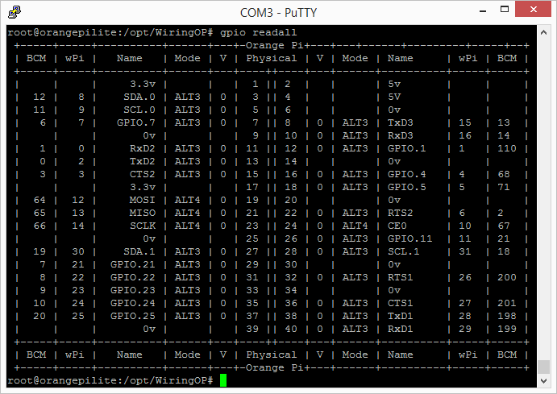

# 2.13inch e-Paper HAT
Examples for Orange Pi Lite board
## Hardware/Software setup
### Orange Pi Lite
#### Hardware connection
If the board you get is the HAT version like 2.13inch e-Paper HAT, you can directly attach it on the 40PIN GPIO of Orange Pi (reversed compared to Raspberry Pi). Or you can wire it to Orange Pi with 8PIN cable.

|**Connect to Orange Pi** |||
|- |- |-|
|  e-Paper | BCM2835 | GPIO |
|VCC|3.3V|3.3V|
|GND|GND|GND|
|DIN|MOSI|19|
|CLK|SCLK|23|
|CS|CE1|26|
|DC|25|22|
|RST|17|11|
|BUSY|24|18|

> Instead of CE1(26), you could also use CE0(24) (and remember to edit *python* and *c* config files accordingly), but I found that Armbian reserves that for something else and before running you would need to release it after every reboot. I lack knowledge to this respect, so I could not figure out a way of releasing it directly from python and I had to run some code in c to do it, so in the end I just modified the channel. Feel free to share any input on that.

#### Enable SPI interface

 - Add these two lines to `/boot/armbianEnv.txt`:
> overlays=spi-spidev
> param_spidev_spi_bus=0
```
sudo echo overlays=spi-spidev>>/boot/armbianEnv.txt;
sudo echo param_spidev_spi_bus=0>>/boot/armbianEnv.txt;
sudo reboot now;
```
 - Confirm that spi is accessible and make it available for all users :
```
ll /dev/spidev*;
```


#### Libraries
##### WiringOP
    mkdir -m 777 /opt/WiringOP;
    git clone https://github.com/zhaolei/WiringOP.git -b h3 /opt/WiringOP;
    cd /opt/WiringOP;
    chmod +x ./build;
    sudo ./build;

 - Confirm that it worked by running the `gpio readall` command and confirming there is a BCM column:
 

##### Python
```
# python2
sudo apt-get update
sudo apt-get install python-dev python-pip python-pil python-numpy
sudo pip install setuptools
sudo pip install wheel
sudo pip install OrangePi.GPIO
sudo pip install spidev
```
#### Download samples

 - Open a terminal and download samples from git:
```
git clone https://github.com/Masatrad-com/e-Paper.git /opt/e-Paper;
cd /opt/e-Paper/OrangePi
```
#### Running examples
##### C codes
Find the main.c file, uncomment the definition of e-Paper types, then compile and run the codes.
```
cd c
make clean
make
sudo ./epd
```
##### python

Run examples, xxx is the name of the e-Paper. For example, if you want to run codes of 2.13inch V2 e-Paper Module, you xxx should be epd_1in13_V2  
```
cd python/examples
# python2
sudo python xxx.py
```
<!--stackedit_data:
eyJoaXN0b3J5IjpbLTE2MjQyMjk5ODcsMTM5MzM2MjE2OCwxNz
E0OTY4NDE1LDY0NDkzMDE3NCwxMDUwMTY5NTY4LC0xMzMwMDUz
NzEzLC0xNzc2NTA2NjMwLC05OTcyNjQ2MTMsNTU0NTgwNzc4LD
EwNTQ1Mzc5MzEsODA4NzM2NTU1LC01MTk4MDgyMiwxNjY1OTMy
MTA2LDEzOTg3NDY3OSwtMjMxNTI2NTg3LC05NTY4MTM2MDgsLT
EyODcwNDA2MjMsMTMwNDUwMzksNDc2Mzg0MjU5LDczMDc3Mzg4
MF19
-->